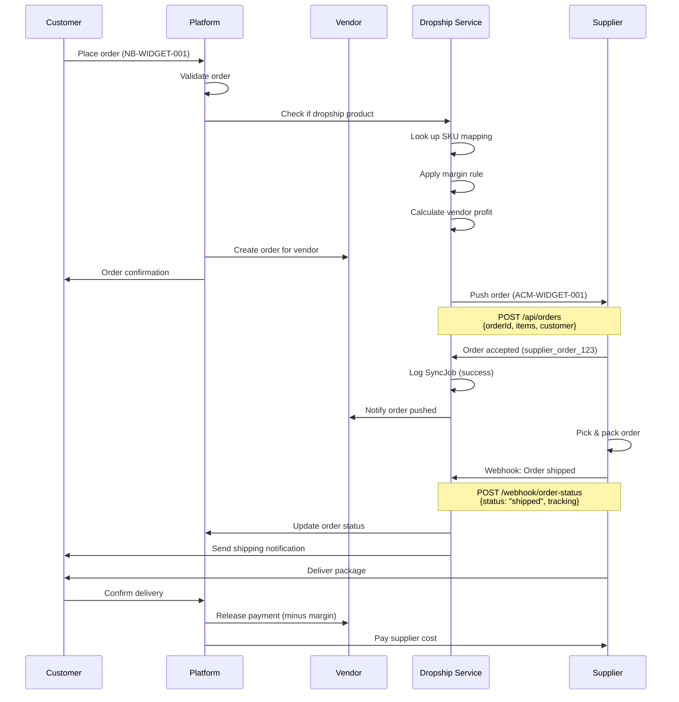
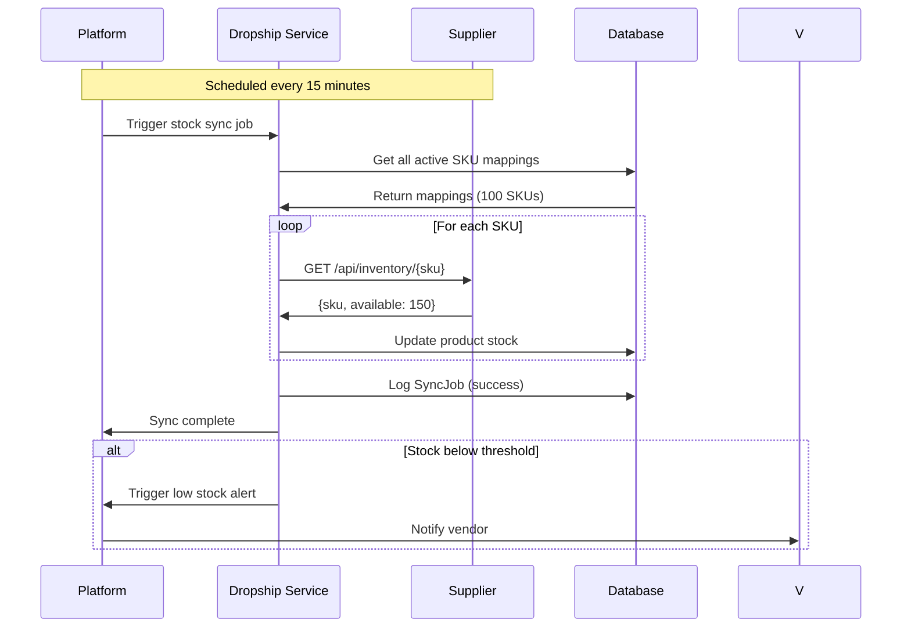
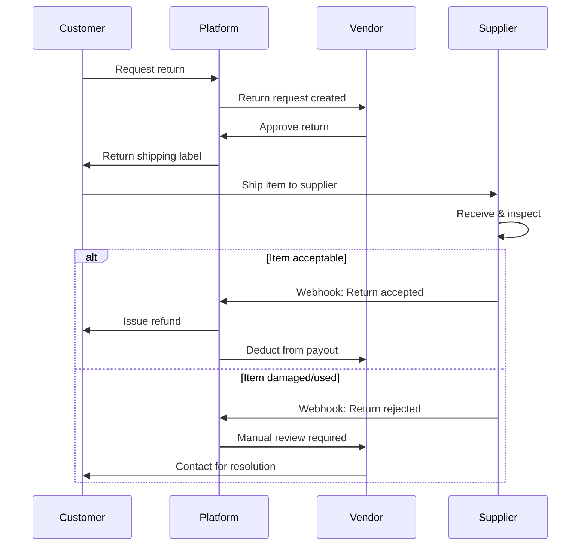

# Dropshipping Module Documentation

> **Quick Reference**: See [DROPSHIP_QUICK_REFERENCE.md](./DROPSHIP_QUICK_REFERENCE.md) for a one-page cheat sheet.

## Table of Contents

- [Overview](#overview)
- [Architecture](#architecture)
- [Key Concepts](#key-concepts)
- [Order Flow](#order-flow)
- [Supplier Integration](#supplier-integration)
- [Data Models](#data-models)
- [API Reference](#api-reference)
- [Webhook Payloads](#webhook-payloads)
- [Configuration](#configuration)
- [Testing](#testing)
- [Troubleshooting](#troubleshooting)

---

## Overview

The dropshipping module enables vendors on the NearbyBazaar platform to source products from third-party suppliers without holding inventory. When a customer orders a dropshipped product, the order is automatically forwarded to the supplier for fulfillment.

### Key Benefits

- **No Inventory Risk**: Vendors don't need to stock products
- **Automated Fulfillment**: Orders automatically sent to suppliers
- **Margin Control**: Vendors set profit margins on supplier products
- **Multi-Supplier**: Support for multiple supplier integrations
- **Real-time Sync**: Stock and pricing synchronized automatically

### Supported Workflows

1. **Manual Dropship**: Vendor manually forwards orders to suppliers
2. **Automated Dropship**: Platform automatically pushes orders via API
3. **Hybrid**: Mix of manual and automated based on supplier capabilities

---

## Architecture

### High-Level Architecture

```
┌─────────────┐
│  Customer   │
└──────┬──────┘
       │ Places order
       ▼
┌─────────────────────────────────────┐
│      NearbyBazaar Platform          │
│                                     │
│  ┌─────────────┐  ┌──────────────┐ │
│  │   Vendor    │  │   Admin      │ │
│  │  Dashboard  │  │   Panel      │ │
│  └─────────────┘  └──────────────┘ │
│                                     │
│  ┌─────────────────────────────┐   │
│  │    Dropship Service         │   │
│  │  - SKU Mapping              │   │
│  │  - Margin Rules             │   │
│  │  - Order Push               │   │
│  │  - Stock Sync               │   │
│  └─────────────────────────────┘   │
└──────────┬──────────────────────────┘
           │ API/Webhook
           ▼
┌─────────────────────────────────────┐
│      Supplier Systems               │
│                                     │
│  ┌──────────┐  ┌──────────────┐    │
│  │Supplier A│  │  Supplier B  │    │
│  │   API    │  │     API      │    │
│  └──────────┘  └──────────────┘    │
└─────────────────────────────────────┘
           │ Fulfillment
           ▼
┌─────────────┐
│  Customer   │
└─────────────┘
```

### Component Architecture

```
apps/api/
├── models/
│   ├── Supplier.ts          # Supplier companies
│   ├── SkuMapping.ts        # SKU translation table
│   ├── MarginRule.ts        # Profit margin rules
│   ├── SyncJob.ts           # Sync job tracking
│   └── Return.ts            # RMA/returns handling
├── routes/dropship/
│   ├── suppliers.ts         # Supplier CRUD
│   ├── mappings.ts          # SKU mapping management
│   ├── margin-rules.ts      # Margin configuration
│   ├── sync.ts              # Stock/price sync
│   └── index.ts             # Main router
├── services/dropship/
│   ├── index.ts             # Supplier registry
│   ├── types.ts             # Interfaces
│   └── outboundWebhook.ts   # Order push logic
└── tests/
    └── dropship.spec.ts     # Comprehensive tests
```

---

## Key Concepts

### 1. Suppliers

External companies that fulfill orders on behalf of vendors.

**Lifecycle**: `invited` → `pending` → `active` → `suspended` / `terminated`

```typescript
{
  companyName: "Acme Wholesale",
  contactName: "John Doe",
  email: "john@acmewholesale.com",
  taxId: "12-3456789",
  status: "active",
  apiEndpoint: "https://api.acmewholesale.com",
  apiKey: "sk_live_abc123..."
}
```

### 2. SKU Mapping

Translation between platform SKUs and supplier SKUs.

```typescript
{
  supplierId: "sup_123",
  supplierSku: "ACM-WIDGET-001",
  ourSku: "NB-WIDGET-001",
  vendorId: "vendor_456",
  productId: "prod_789"
}
```

**Example**:
- Customer orders: `NB-WIDGET-001`
- Platform looks up: `ACM-WIDGET-001`
- Order sent to supplier with: `ACM-WIDGET-001`

### 3. Margin Rules

Define profit margins vendors earn on supplier products.

**Types**:
- **Percent**: `25%` markup → Supplier cost $100 = Selling price $125
- **Fixed**: `$10` markup → Supplier cost $50 = Selling price $60

**Priority** (most specific wins):
1. Category + Supplier specific
2. Supplier specific
3. Vendor default

```typescript
{
  vendorId: "vendor_456",
  supplierId: "sup_123",
  category: "electronics",
  marginType: "percent",
  value: 30, // 30% markup
  active: true
}
```

### 4. Sync Jobs

Track background jobs for syncing stock, prices, and order status.

```typescript
{
  vendorId: "vendor_456",
  jobType: "stock-sync" | "price-sync" | "order-push",
  status: "pending" | "success" | "failed",
  startedAt: "2025-10-20T10:00:00Z",
  completedAt: "2025-10-20T10:01:23Z",
  error: null
}
```

---

## Order Flow

### Sequence Diagram: Customer Order to Supplier



### Sequence Diagram: Stock Sync



### Sequence Diagram: Return/RMA Flow



---

## Supplier Integration

### Integration Types

#### 1. REST API Integration (Recommended)

Supplier provides REST API for order push, stock sync, and status updates.

**Required Endpoints**:
- `POST /api/orders` - Receive orders
- `GET /api/inventory/{sku}` - Get stock levels
- `GET /api/pricing/{sku}` - Get current pricing
- `POST /api/webhooks/status` - Receive status updates (optional)

#### 2. Webhook Integration

Platform sends webhooks to supplier systems for events.

**Supported Events**:
- `order.created` - New order placed
- `order.cancelled` - Order cancelled
- `return.requested` - Customer requested return

#### 3. Manual Integration

Vendor manually forwards order details to supplier via email/portal.

**Use Cases**:
- Small suppliers without APIs
- Testing new supplier relationships
- Backup for API failures

---

## Data Models

### Supplier Model

```typescript
interface Supplier {
  _id: ObjectId;
  companyName: string;          // "Acme Wholesale"
  contactName: string;          // "John Doe"
  email: string;                // "john@acmewholesale.com"
  taxId: string;                // "12-3456789"
  address: string;              // Physical address
  phone: string;                // Contact phone
  status: SupplierStatus;       // invited | pending | active | suspended | terminated
  invitedAt?: Date;             // When invited
  approvedAt?: Date;            // When approved
  suspendedAt?: Date;           // If suspended
  terminatedAt?: Date;          // If terminated
  kycDocs?: string[];           // KYC document URLs
  apiEndpoint?: string;         // API base URL
  apiKey?: string;              // Authentication key
  webhookUrl?: string;          // Webhook endpoint
  createdAt: Date;
  updatedAt: Date;
}
```

### SKU Mapping Model

```typescript
interface SkuMapping {
  _id: ObjectId;
  supplierId: string;           // References Supplier
  vendorId: string;             // References Vendor
  productId: string;            // References Product
  supplierSku: string;          // "ACM-WIDGET-001"
  ourSku: string;               // "NB-WIDGET-001"
  status: 'active' | 'inactive';
  createdAt: Date;
  updatedAt: Date;
}

// Unique index: (supplierId, supplierSku)
```

### Margin Rule Model

```typescript
interface MarginRule {
  _id: ObjectId;
  vendorId: ObjectId;           // References Vendor
  supplierId?: ObjectId;        // Optional: specific supplier
  category?: string;            // Optional: specific category
  marginType: 'percent' | 'fixed';
  value: number;                // 25 (percent) or 10.00 (fixed)
  active: boolean;
  createdAt: Date;
}
```

### Sync Job Model

```typescript
interface SyncJob {
  _id: ObjectId;
  vendorId: string;
  jobType: 'stock-sync' | 'price-sync' | 'order-push' | 'order-status';
  status: 'pending' | 'success' | 'failed';
  startedAt: Date;
  completedAt?: Date;
  error?: string;
  metadata?: {
    skuCount?: number;
    orderId?: string;
    supplierId?: string;
  };
}
```

---

## API Reference

See detailed API documentation: [DROPSHIP_API.md](./DROPSHIP_API.md)

### Quick Reference

| Endpoint | Method | Description |
|----------|--------|-------------|
| `/api/dropship/suppliers` | GET | List suppliers |
| `/api/dropship/suppliers` | POST | Create supplier |
| `/api/dropship/suppliers/:id` | GET | Get supplier |
| `/api/dropship/suppliers/:id` | PUT | Update supplier |
| `/api/dropship/suppliers/:id/status` | PATCH | Update status |
| `/api/dropship/mappings` | GET | List SKU mappings |
| `/api/dropship/mappings` | POST | Create mapping |
| `/api/dropship/mappings/bulk` | POST | Bulk create mappings |
| `/api/dropship/margin-rules` | GET | List margin rules |
| `/api/dropship/margin-rules` | POST | Create margin rule |
| `/api/dropship/margin-rules/calculate-price` | POST | Calculate selling price |
| `/api/dropship/sync/trigger` | POST | Trigger sync job |
| `/api/dropship/sync/status/:jobId` | GET | Get sync job status |

---

## Webhook Payloads

### 1. Order Push to Supplier

**Endpoint**: Supplier's order API (e.g., `POST https://api.supplier.com/orders`)

**Headers**:
```http
Content-Type: application/json
X-Idempotency-Key: order:ORD-12345:supplier:SUP-001
Authorization: Bearer sk_live_abc123...
```

**Request Payload**:
```json
{
  "orderId": "ORD-12345",
  "vendorOrderId": "VENDOR-ORD-789",
  "placedAt": "2025-10-20T10:30:00Z",
  "items": [
    {
      "sku": "ACM-WIDGET-001",
      "quantity": 2,
      "unitPrice": 29.99,
      "total": 59.98
    },
    {
      "sku": "ACM-GADGET-200",
      "quantity": 1,
      "unitPrice": 49.99,
      "total": 49.99
    }
  ],
  "customer": {
    "name": "Jane Smith",
    "email": "jane@example.com",
    "phone": "+1-555-0123",
    "address": {
      "line1": "123 Main Street",
      "line2": "Apt 4B",
      "city": "New York",
      "state": "NY",
      "postalCode": "10001",
      "country": "US"
    }
  },
  "shipping": {
    "method": "standard",
    "cost": 0,
    "notes": "Please pack items carefully"
  },
  "total": 109.97,
  "currency": "USD",
  "metadata": {
    "platformOrderId": "ORD-12345",
    "vendorId": "vendor_456",
    "requestedShipDate": "2025-10-21"
  }
}
```

**Success Response** (200 OK):
```json
{
  "success": true,
  "supplierOrderId": "SUP-ORD-ABC123",
  "status": "accepted",
  "estimatedShipDate": "2025-10-22",
  "items": [
    {
      "sku": "ACM-WIDGET-001",
      "status": "in_stock",
      "availableQuantity": 150
    },
    {
      "sku": "ACM-GADGET-200",
      "status": "in_stock",
      "availableQuantity": 50
    }
  ],
  "message": "Order accepted and will be processed within 24 hours"
}
```

**Error Response** (400 Bad Request):
```json
{
  "success": false,
  "error": {
    "code": "INSUFFICIENT_INVENTORY",
    "message": "Item ACM-GADGET-200 is out of stock",
    "details": {
      "sku": "ACM-GADGET-200",
      "requested": 1,
      "available": 0,
      "restockDate": "2025-10-25"
    }
  }
}
```

### 2. Order Status Webhook (from Supplier)

**Endpoint**: Platform webhook (e.g., `POST https://api.nearbybazaar.com/webhooks/supplier/order-status`)

**Headers**:
```http
Content-Type: application/json
X-Webhook-Signature: sha256=abc123def456...
X-Supplier-Id: SUP-001
```

**Payload** (Order Shipped):
```json
{
  "event": "order.shipped",
  "timestamp": "2025-10-21T14:30:00Z",
  "supplierOrderId": "SUP-ORD-ABC123",
  "platformOrderId": "ORD-12345",
  "data": {
    "status": "shipped",
    "shippedAt": "2025-10-21T14:30:00Z",
    "carrier": "FedEx",
    "trackingNumber": "1234567890",
    "trackingUrl": "https://fedex.com/track?num=1234567890",
    "items": [
      {
        "sku": "ACM-WIDGET-001",
        "quantity": 2,
        "serialNumbers": ["SN123", "SN124"]
      },
      {
        "sku": "ACM-GADGET-200",
        "quantity": 1,
        "serialNumbers": ["SN456"]
      }
    ],
    "estimatedDeliveryDate": "2025-10-25"
  }
}
```

**Platform Response** (200 OK):
```json
{
  "success": true,
  "message": "Order status updated successfully"
}
```

### 3. Stock Sync Request

**Endpoint**: Supplier inventory API (e.g., `GET https://api.supplier.com/inventory/{sku}`)

**Headers**:
```http
Authorization: Bearer sk_live_abc123...
Accept: application/json
```

**Response**:
```json
{
  "sku": "ACM-WIDGET-001",
  "available": 150,
  "reserved": 25,
  "incoming": 500,
  "incomingDate": "2025-10-25",
  "lowStockThreshold": 20,
  "status": "in_stock",
  "lastUpdated": "2025-10-20T15:00:00Z",
  "warehouse": {
    "location": "Warehouse A",
    "zone": "B-12"
  }
}
```

### 4. Price Sync Request

**Endpoint**: Supplier pricing API (e.g., `GET https://api.supplier.com/pricing/{sku}`)

**Response**:
```json
{
  "sku": "ACM-WIDGET-001",
  "price": 29.99,
  "currency": "USD",
  "msrp": 49.99,
  "costBasis": 25.00,
  "validFrom": "2025-10-01",
  "validUntil": "2025-10-31",
  "discounts": [
    {
      "minQuantity": 10,
      "price": 27.99,
      "description": "Bulk discount"
    },
    {
      "minQuantity": 50,
      "price": 25.99,
      "description": "Volume discount"
    }
  ],
  "lastUpdated": "2025-10-15T10:00:00Z"
}
```

### 5. Return/RMA Notification

**Endpoint**: Supplier RMA API (e.g., `POST https://api.supplier.com/returns`)

**Request**:
```json
{
  "returnId": "RMA-12345",
  "originalOrderId": "SUP-ORD-ABC123",
  "platformOrderId": "ORD-12345",
  "requestedAt": "2025-10-22T10:00:00Z",
  "reason": "defective",
  "reasonDetails": "Item does not power on",
  "items": [
    {
      "sku": "ACM-WIDGET-001",
      "quantity": 1,
      "serialNumber": "SN123",
      "condition": "unopened"
    }
  ],
  "customer": {
    "name": "Jane Smith",
    "email": "jane@example.com"
  },
  "returnShipping": {
    "carrier": "FedEx",
    "trackingNumber": "9876543210",
    "estimatedArrival": "2025-10-25"
  },
  "refundAmount": 29.99,
  "refundMethod": "original_payment"
}
```

**Response**:
```json
{
  "success": true,
  "rmaNumber": "SUP-RMA-999",
  "status": "approved",
  "returnAddress": {
    "name": "Acme Wholesale Returns",
    "line1": "500 Industrial Pkwy",
    "city": "Commerce",
    "state": "CA",
    "postalCode": "90001",
    "country": "US"
  },
  "instructions": "Please include RMA number SUP-RMA-999 in the package",
  "estimatedProcessingDays": 3
}
```

---

## Configuration

### Environment Variables

```bash
# Supplier API Configuration
SUPPLIER_API_TIMEOUT=10000          # Request timeout (ms)
SUPPLIER_API_RETRY_ATTEMPTS=3      # Retry failed requests
SUPPLIER_API_RETRY_DELAY=1000      # Delay between retries (ms)

# Sync Configuration
STOCK_SYNC_INTERVAL=900000          # 15 minutes
PRICE_SYNC_INTERVAL=3600000         # 1 hour
SYNC_BATCH_SIZE=100                 # SKUs per batch

# Webhook Configuration
WEBHOOK_SECRET=your_webhook_secret  # For signature verification
WEBHOOK_TIMEOUT=5000                # Webhook timeout (ms)

# Rate Limiting Configuration
REDIS_HOST=localhost                # Redis host for rate limiting
REDIS_PORT=6379                     # Redis port
REDIS_DB=0                          # Redis database number

# Feature Flags
ENABLE_AUTO_DROPSHIP=true           # Auto-push orders
ENABLE_STOCK_SYNC=true              # Auto-sync stock
ENABLE_PRICE_SYNC=true              # Auto-sync prices
ENABLE_RATE_LIMITING=true           # Enable supplier rate limiting
```

### Supplier Configuration File

```json
{
  "suppliers": [
    {
      "id": "acme-wholesale",
      "name": "Acme Wholesale",
      "apiEndpoint": "https://api.acmewholesale.com",
      "apiKey": "${ACME_API_KEY}",
      "webhookUrl": "https://api.nearbybazaar.com/webhooks/acme",
      "features": {
        "orderPush": true,
        "stockSync": true,
        "priceSync": true,
        "trackingUpdates": true,
        "rmaSupport": true
      },
      "limits": {
        "maxOrderValue": 10000,
        "maxItems": 50,
        "rateLimitPerMinute": 60
      },
      "rateLimitTier": "default"
    }
  ]
}
```

### Rate Limiting

The dropshipping module uses Redis-based rate limiting to prevent overwhelming supplier APIs with too many requests. Rate limits are applied per supplier using a sliding window algorithm.

#### Rate Limit Tiers

| Tier          | Max Requests | Window    | Use Case                     |
|---------------|--------------|-----------|------------------------------|
| `conservative`| 30/minute    | 60s       | Suppliers with strict limits |
| `default`     | 60/minute    | 60s       | Standard supplier APIs       |
| `premium`     | 120/minute   | 60s       | High-volume suppliers        |

#### Configuration

Set the `rateLimitTier` property on each supplier:

```javascript
const supplier = await Supplier.findById(supplierId);
supplier.rateLimitTier = 'premium'; // or 'default', 'conservative'
await supplier.save();
```

#### Custom Rate Limits

You can set custom rate limits per supplier:

```javascript
import { SupplierRateLimiter } from './services/dropship/rateLimiter';

const rateLimiter = new SupplierRateLimiter(redis, {
  maxRequests: 90,
  windowMs: 60000, // 90 requests per minute
});

const result = await rateLimiter.checkAndRecord(supplierId);
if (!result.allowed) {
  console.log(`Rate limited. Retry after ${result.retryAfter}ms`);
}
```

#### Retry Queue

When a request exceeds the rate limit, it's automatically queued for retry:

```javascript
// Automatic retry queueing
const result = await pushOrderToSupplier(order, supplier);

if (result.status === 'rate_limited') {
  console.log(`Order queued for retry in ${result.retryAfter}ms`);
}

// Process retry queue (run periodically via cron)
import { processRetryQueue } from './services/dropship/outboundWebhook';

// Process all suppliers' retry queues
const suppliers = await Supplier.find({ status: 'active' });
for (const supplier of suppliers) {
  await processRetryQueue(supplier.id);
}
```

#### Monitoring

Monitor rate limit metrics to optimize supplier configurations:

```javascript
import { SupplierRateLimiter } from './services/dropship/rateLimiter';

const rateLimiter = getRateLimiter();

// Check current status
const status = await rateLimiter.getStatus(supplierId);
console.log(`Remaining: ${status.remaining}/${status.limit}`);
console.log(`Resets at: ${new Date(status.resetAt)}`);

// Check queue length
const retryQueue = getRetryQueue();
const queueLength = await retryQueue.getQueueLength(supplierId);
console.log(`Queued requests: ${queueLength}`);
```

#### Best Practices

1. **Set Appropriate Tiers**: Start with `default` tier, adjust based on supplier feedback
2. **Monitor Queue Length**: High queue lengths indicate limits are too strict
3. **Process Retries Regularly**: Run `processRetryQueue()` every 30-60 seconds via cron
4. **Fail-Open Strategy**: If Redis is unavailable, requests are allowed to prevent service disruption
5. **Per-Supplier Isolation**: One slow supplier won't block others (fairness guarantee)
6. **Log Rate Limits**: Track when suppliers are rate limited to identify bottlenecks

#### Example: Setting Up Cron for Retry Processing

```javascript
// Using node-cron
import cron from 'node-cron';
import { processRetryQueue } from './services/dropship/outboundWebhook';
import { Supplier } from './models/Supplier';

// Process retry queues every 30 seconds
cron.schedule('*/30 * * * * *', async () => {
  const suppliers = await Supplier.find({ status: 'active' });
  
  for (const supplier of suppliers) {
    try {
      await processRetryQueue(supplier.id);
    } catch (error) {
      console.error(`Failed to process retry queue for ${supplier.id}:`, error);
    }
  }
});
```

---

## Testing

See comprehensive testing documentation: [DROPSHIP_TESTING.md](./DROPSHIP_TESTING.md)

### Quick Test Commands

```bash
# Run all dropship tests
pnpm --filter @nearbybazaar/api test dropship.spec.ts

# Run with coverage
pnpm --filter @nearbybazaar/api test --coverage

# Test specific scenario
pnpm test -- -t "should push order to supplier"
```

### Test Suppliers

Mock suppliers available for testing:

```typescript
import { MockDropshipSupplier } from './services/dropship';

const mockSupplier = new MockDropshipSupplier();
await mockSupplier.connect();
const stock = await mockSupplier.syncStock('TEST-SKU'); // Returns 100
const price = await mockSupplier.syncPrice('TEST-SKU'); // Returns 9.99
```

---

## Troubleshooting

### Common Issues

#### Order Not Pushed to Supplier

**Symptoms**: Order placed but not sent to supplier

**Checklist**:
1. ✅ Supplier status is `active`
2. ✅ SKU mapping exists for product
3. ✅ Supplier API endpoint configured
4. ✅ API credentials valid
5. ✅ Check SyncJob logs for errors

**Debug**:
```bash
# Check SKU mapping
curl http://localhost:3000/api/dropship/mappings?ourSku=NB-WIDGET-001

# Check supplier status
curl http://localhost:3000/api/dropship/suppliers/:id

# Check recent sync jobs
curl http://localhost:3000/api/dropship/sync/history?jobType=order-push&status=failed
```

#### Stock Not Syncing

**Symptoms**: Product stock levels not updating

**Checklist**:
1. ✅ Stock sync enabled (`ENABLE_STOCK_SYNC=true`)
2. ✅ Sync job running (check cron/scheduler)
3. ✅ Supplier API responding
4. ✅ API rate limits not exceeded

**Debug**:
```bash
# Manually trigger sync
curl -X POST http://localhost:3000/api/dropship/sync/trigger \
  -H "Content-Type: application/json" \
  -d '{"jobType": "stock-sync", "supplierId": "sup_123"}'

# Check sync job status
curl http://localhost:3000/api/dropship/sync/status/:jobId
```

#### Incorrect Pricing

**Symptoms**: Selling price doesn't match expected margin

**Checklist**:
1. ✅ Margin rule configured correctly
2. ✅ Margin rule is `active`
3. ✅ Latest supplier cost synced
4. ✅ Correct margin rule priority applied

**Debug**:
```bash
# Check margin rules
curl http://localhost:3000/api/dropship/margin-rules?vendorId=vendor_456

# Test price calculation
curl -X POST http://localhost:3000/api/dropship/margin-rules/calculate-price \
  -H "Content-Type: application/json" \
  -d '{
    "vendorId": "vendor_456",
    "supplierId": "sup_123",
    "category": "electronics",
    "cost": 100
  }'
```

#### Duplicate Orders Sent

**Symptoms**: Supplier receives same order multiple times

**Solution**: Idempotency is built-in using `X-Idempotency-Key` header.

**Verify**:
- Check SyncJob logs for duplicate entries
- Ensure idempotency key format: `order:{orderId}:supplier:{supplierId}`
- Supplier should handle duplicate requests with same idempotency key

#### Webhook Signature Verification Failed

**Symptoms**: Supplier webhooks rejected

**Solution**:
```typescript
import crypto from 'crypto';

function verifyWebhookSignature(payload: string, signature: string, secret: string): boolean {
  const hmac = crypto.createHmac('sha256', secret);
  hmac.update(payload);
  const expectedSignature = `sha256=${hmac.digest('hex')}`;
  return crypto.timingSafeEqual(
    Buffer.from(signature),
    Buffer.from(expectedSignature)
  );
}
```

### Error Codes

| Code | Description | Action |
|------|-------------|--------|
| `SUPPLIER_INACTIVE` | Supplier not active | Activate supplier or use different supplier |
| `SKU_NOT_MAPPED` | No SKU mapping found | Create SKU mapping |
| `INSUFFICIENT_INVENTORY` | Product out of stock | Wait for restock or use alternative |
| `API_TIMEOUT` | Supplier API timeout | Retry or check supplier status |
| `INVALID_MARGIN_RULE` | Margin rule misconfigured | Fix margin rule configuration |
| `ORDER_ALREADY_PUSHED` | Duplicate order detected | Check SyncJob for original push status |

### Monitoring

**Key Metrics to Monitor**:

1. **Order Push Success Rate**: `success_count / total_count`
2. **Average API Response Time**: Track supplier API latency
3. **Stock Sync Frequency**: Ensure syncs running on schedule
4. **Failed Jobs**: Monitor `SyncJob` with `status: 'failed'`
5. **Margin Accuracy**: Compare expected vs actual prices

**Alerts to Configure**:
- Order push failure rate >5%
- Stock sync missed for >30 minutes
- Supplier API response time >5 seconds
- Failed jobs >10 in 1 hour

---

## Related Documentation

- [Dropship API Reference](./DROPSHIP_API.md) - Complete REST API documentation
- [Dropship Testing Guide](./DROPSHIP_TESTING.md) - Testing best practices
- [Dropship Testing Checklist](./DROPSHIP_TESTING_CHECKLIST.md) - Quick reference
- [Feature Implementation Reports](./DROPSHIP_API_SUMMARY.md) - Development history

---

## Support

For questions or issues:

1. Check this documentation first
2. Review [Troubleshooting](#troubleshooting) section
3. Check GitHub issues
4. Contact: dropship-support@nearbybazaar.com

---

**Last Updated**: October 20, 2025
**Version**: 1.0.0
**Status**: Production Ready
