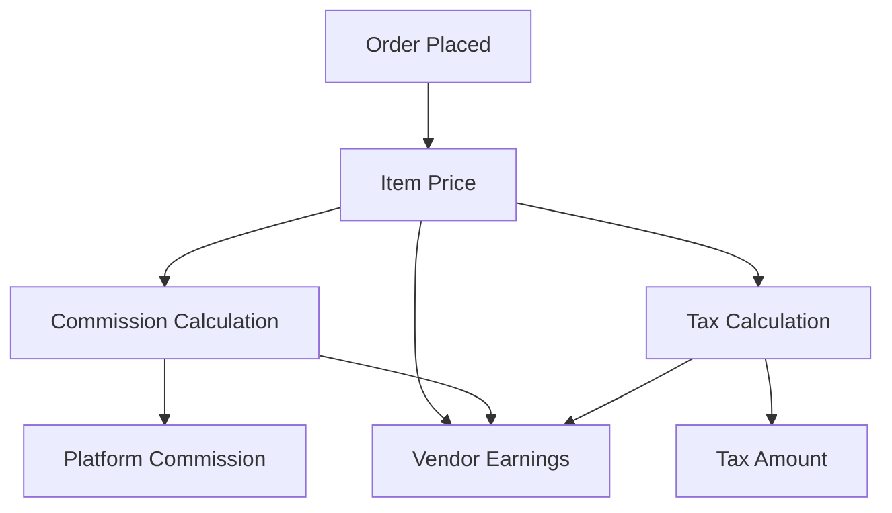

# Pricing & Commission Logic

This document explains how NearbyBazaar calculates prices, commissions, and taxes for each order, and how these amounts are split between the vendor and the platform.

## Overview
- **Item Price**: The base price set by the vendor for each product.
- **Commission**: The platform fee, calculated per commission rules (fixed, percentage, tiered, or vendor/category overrides).
- **Tax**: GST or other applicable taxes, calculated on the item price (not including commission).
- **Vendor Earnings**: The amount the vendor receives after commission is deducted.

## Calculation Flow



## Example Calculation

Suppose a customer orders a product priced at **₹100**.
- **Commission Rule**: 10% of item price
- **GST**: 18% of item price

| Component         | Calculation         | Amount (₹) |
|-------------------|--------------------|------------|
| Item Price        | 100                | 100        |
| Commission        | 100 × 10%          | 10         |
| Tax (GST)         | 100 × 18%          | 18         |
| Vendor Earnings   | 100 - 10           | 90         |
| Total Paid        | 100 + 18           | 118        |

- **Vendor receives:** ₹90
- **Platform commission:** ₹10
- **Tax collected:** ₹18
- **Customer pays:** ₹118

## Notes
- Commission is deducted before tax is applied; tax is calculated on the item price, not on the commission.
- Commission rules may vary by vendor, category, or promotional overrides.
- For tiered commissions, the rate may change based on price or quantity.

## API Reference
- `/pricing/quote`: Returns a price quote with commission and tax breakdown for any product.
- Invoice builder ensures commission and tax are shown separately for vendor clarity and compliance.

## Diagrams

### Price Split

```mermaid
graph LR;
    Customer -->|Pays ₹118| Platform
    Platform -->|₹90| Vendor
    Platform -->|₹10| Commission
    Platform -->|₹18| Tax Authority
```

---
For more details, see the commission rules in `apps/api/src/services/commission/rules.ts` and invoice logic in `apps/api/src/services/invoice/builder.ts`.
